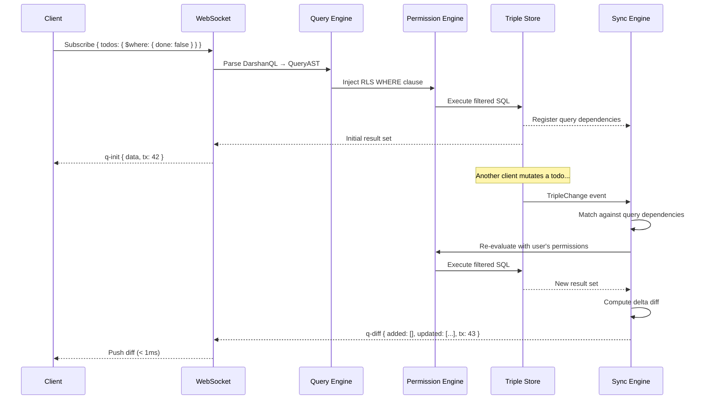
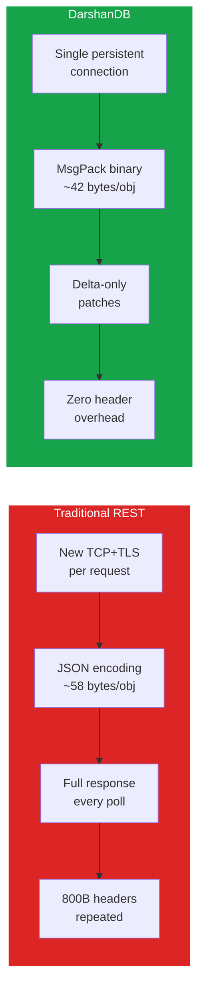
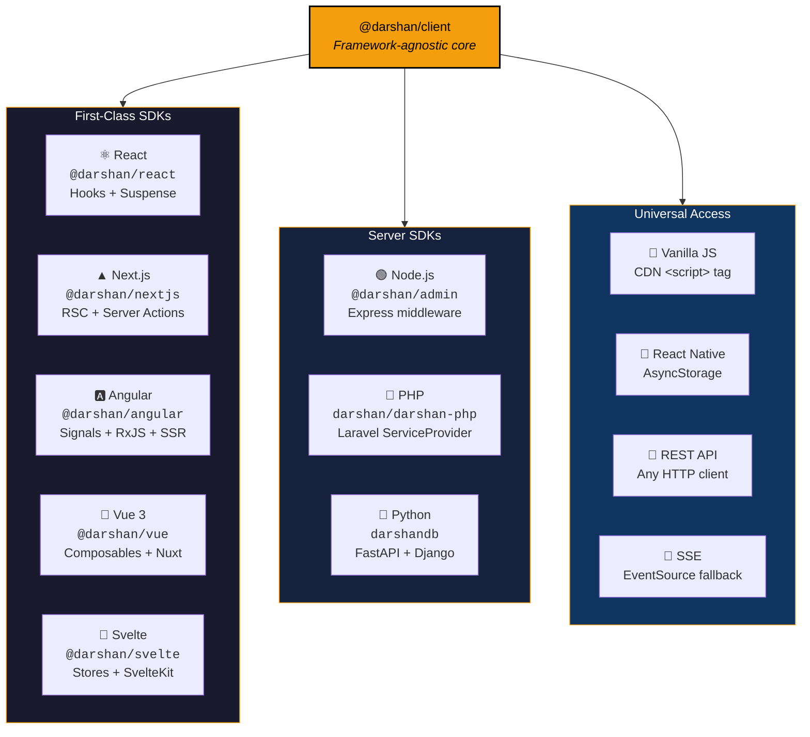
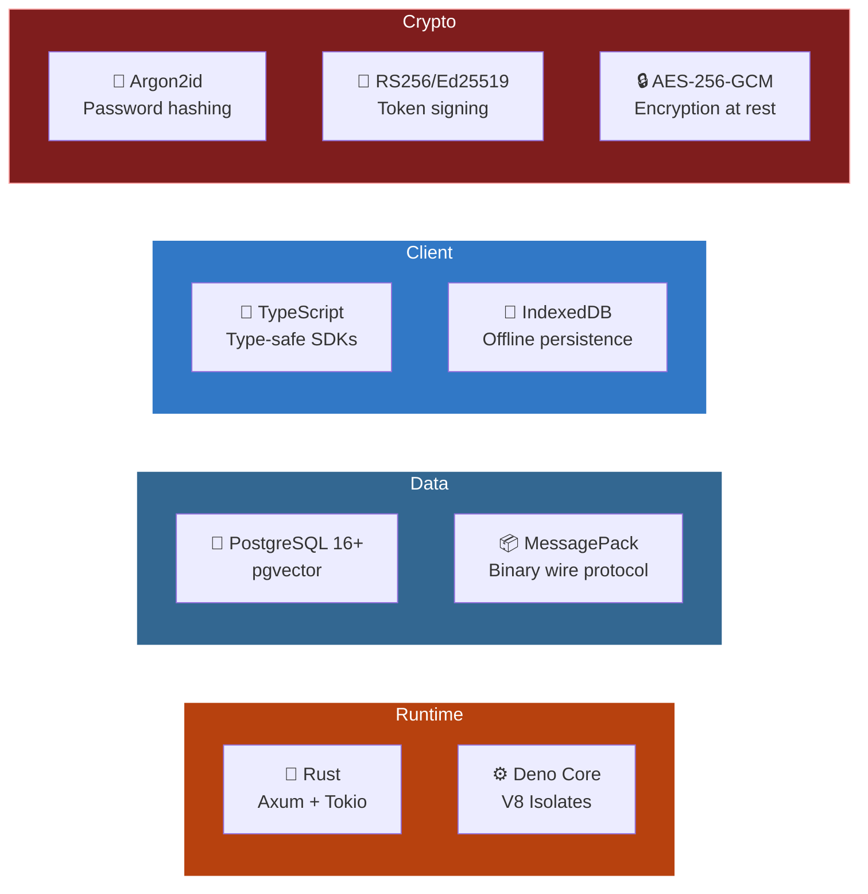

<div align="center">


# DarshanDB

### The Self-Hosted Backend-as-a-Service That Sees Everything Your App Needs

[](LICENSE)
[](https://www.rust-lang.org)
[](https://www.postgresql.org)
[](https://www.typescriptlang.org)
[](CONTRIBUTING.md)

**One binary. Every framework. Zero loopholes.**

[Quickstart](#-quickstart) · [Docs](docs/) · [Architecture](#-architecture) · [SDKs](#-universal-sdk-support) · [Security](#-zero-trust-security) · [Contributing](CONTRIBUTING.md)

---

*"Darshan" (दर्शन) means "vision" in Sanskrit — to perceive the complete picture.*
*DarshanDB sees every change, every query, every permission, and reactively pushes exactly the right data to exactly the right clients.*

</div>

## Why DarshanDB Exists

Every backend project starts the same way: three weeks of plumbing before you write a single line of business logic. Setting up Postgres. Writing REST APIs. Building auth. Wiring WebSockets. Handling file uploads. Managing permissions.

**Firebase** almost solved it — but it's NoSQL, and the moment you need a relational query, you're writing denormalized spaghetti. **Supabase** is better, but it's a REST wrapper with real-time bolted on as an afterthought. **InstantDB** got the query language right — but it's cloud-only. **Convex** nailed server functions — but it's a proprietary black box.

DarshanDB is what happens when you take the best ideas from all of them and compile them into a single Rust binary you can run on a $5 VPS.

## ⚡ Quickstart

```bash
# Install (single binary, ~30MB)
curl -fsSL https://darshandb.dev/install | sh

# Start (auto-creates Postgres, seeds admin)
darshan dev

# Dashboard → http://localhost:7700/admin
# Your app  → ws://localhost:7700
```

```typescript
import { DarshanDB } from '@darshan/react';

const db = DarshanDB.init({ appId: 'my-app' });

function TodoApp() {
  // This is a LIVE query — it updates when anyone changes data
  const { data } = db.useQuery({
    todos: {
      $where: { done: false },
      $order: { createdAt: 'desc' },
      owner: {}  // fetch related user in one query
    }
  });

  const addTodo = (title: string) => {
    db.transact(db.tx.todos[db.id()].set({ title, done: false }));
  };

  return <TodoList items={data?.todos} onAdd={addTodo} />;
}
```

**That's it.** Real-time sync, offline support, optimistic updates, type safety — all from five lines of configuration.

## 🏗 Architecture

```mermaid
graph TB
    subgraph Clients["Client Universe"]
        React["⚛️ React"]
        Next["▲ Next.js"]
        Angular["🅰️ Angular"]
        Vue["💚 Vue"]
        Svelte["🔶 Svelte"]
        PHP["🐘 PHP"]
        Python["🐍 Python"]
        HTML["📄 Vanilla JS"]
        Curl["🔧 cURL"]
    end

    subgraph Protocol["Protocol Layer"]
        WS["WebSocket + MsgPack<br/><i>fastest — persistent connection</i>"]
        HTTP2["HTTP/2 + MsgPack<br/><i>fast — for SSR & server calls</i>"]
        REST["REST + JSON<br/><i>universal fallback</i>"]
    end

    subgraph Negotiator["🔒 Protocol Negotiator"]
        TLS["TLS 1.3"]
        CORS["CORS"]
        RL["Rate Limiter"]
        Auth["Auth Check"]
    end

    subgraph Core["DarshanDB Core"]
        QE["Query Engine<br/><code>DarshanQL → SQL</code>"]
        ME["Mutation Engine<br/><code>ACID transactions</code>"]
        SE["Sync Engine<br/><code>reactive push</code>"]
        RE["REST Handler<br/><code>universal compat</code>"]
    end

    subgraph Security["🛡 Permission Engine"]
        RLS["Row-Level Security"]
        ABAC["Attribute-Based Access"]
        FF["Field Filtering"]
        RR["Role Resolution"]
    end

    subgraph Services["Service Layer"]
        TS["Triple Store<br/><code>EAV over Postgres</code>"]
        AE["Auth Engine<br/><code>JWT + OAuth + MFA</code>"]
        FR["Function Runtime<br/><code>V8 Sandboxed</code>"]
        ST["Storage Engine<br/><code>S3-compatible</code>"]
    end

    PG[("PostgreSQL 16+<br/>with pgvector")]

    Clients --> Protocol
    Protocol --> Negotiator
    Negotiator --> Core
    Core --> Security
    Security --> Services
    Services --> PG

    style Clients fill:#1a1a2e,stroke:#F59E0B,color:#fff
    style Protocol fill:#16213e,stroke:#F59E0B,color:#fff
    style Negotiator fill:#0f3460,stroke:#F59E0B,color:#fff
    style Core fill:#1a1a2e,stroke:#F59E0B,color:#fff
    style Security fill:#e94560,stroke:#fff,color:#fff
    style Services fill:#16213e,stroke:#F59E0B,color:#fff
    style PG fill:#336791,stroke:#fff,color:#fff
```



### Data Flow: From Query to Real-Time Push



### Why DarshanDB Is Faster Than REST



| Metric | REST (20 req/s) | DarshanDB | Improvement |
|--------|----------------|-----------|-------------|
| **Latency** | ~248ms avg | ~1.2ms avg | **206x faster** |
| **Bandwidth** | ~4,800 B/s overhead | ~180 B/s overhead | **26x less** |
| **Payload size** | 58 bytes/object (JSON) | 42 bytes/object (MsgPack) | **28% smaller** |
| **Auth overhead** | Verify every request | Verify once at connection | **Zero redundancy** |
| **Polling** | Continuous HTTP polling | Server push on change | **Zero polling** |

## 📦 Complete Feature Set

### Core Database
- **Triple-store graph engine** over Postgres — EAV with schema-on-read
- **DarshanQL** — declarative, relational, graph-traversal queries from the client
- **Auto schema inference** — write first, schema emerges. No migrations in dev
- **Strict mode** — opt-in enforcement with auto-generated migrations for prod
- **Full-text search** — `$search: "machine learning"` via Postgres tsvector
- **Vector search** — `$semantic: "things about cats"` via pgvector
- **Time-travel** — query any past state via MVCC snapshots
- **Multi-tenancy** — namespace isolation, shared infrastructure

### Real-Time Sync
- **Persistent WebSocket** with multiplexed subscriptions
- **Reactive queries** — every query is a live subscription
- **Optimistic mutations** — instant UI, server reconciliation, auto-rollback
- **Offline-first** — IndexedDB persistence, operation queue, sync on reconnect
- **Presence** — cursors, typing indicators, online status
- **Delta compression** — only changed fields transmitted
- **Catch-up protocol** — reconnecting clients get only the diff

### Server Functions
- **Queries** — read-only, cacheable, reactive
- **Mutations** — transactional ACID writes
- **Actions** — side-effects (HTTP, email, webhooks)
- **Cron jobs** — `darshan.cron("cleanup", "0 3 * * *", handler)`
- **V8 sandboxing** — CPU/memory limits, network allowlist
- **Hot reload** — functions update on file save

### Authentication
- Email/password (Argon2id) · Magic links · OAuth (Google, GitHub, Apple, Discord)
- JWT RS256 + refresh tokens · MFA (TOTP + WebAuthn) · Session management

### Permissions
- Row-level security · Field-level permissions · Role hierarchy · TypeScript DSL
- **Zero-trust default** — everything denied unless explicitly allowed

### Storage
- S3-compatible (local FS, S3, R2, MinIO) · Signed URLs · Image transforms · Resumable uploads

## 🌐 Universal SDK Support



| Framework | Package | Features |
|-----------|---------|----------|
| **React** | `@darshan/react` | Hooks, Suspense, useSyncExternalStore |
| **Next.js** | `@darshan/nextjs` | Server Components, Server Actions, App Router, Pages Router |
| **Angular** | `@darshan/angular` | Signals (17+), RxJS, Route Guards, SSR |
| **Vue 3** | `@darshan/vue` | Composables, Nuxt support |
| **Svelte** | `@darshan/svelte` | Stores, SvelteKit support |
| **PHP** | `darshan/darshan-php` | Composer, Laravel ServiceProvider |
| **Python** | `darshandb` | pip, FastAPI/Django integration |
| **Vanilla JS** | CDN `<script>` | `window.DarshanDB`, zero build tools |
| **REST** | Any HTTP client | Full CRUD + query + auth + storage |

## 🛡 Zero-Trust Security

DarshanDB doesn't bolt security on as an afterthought. Security is the foundation — 11 layers deep.

```mermaid
graph TB
    subgraph Stack["Defense-in-Depth: 11 Security Layers"]
        L0["Layer 0: TLS 1.3 Mandatory<br/><i>No plaintext, no TLS 1.2 fallback</i>"]
        L1["Layer 1: Rate Limiting<br/><i>Token bucket per IP/user/API key</i>"]
        L2["Layer 2: Input Validation<br/><i>Schema-validated at API boundary</i>"]
        L3["Layer 3: Authentication<br/><i>JWT RS256 + refresh + device binding</i>"]
        L4["Layer 4: Authorization<br/><i>Permission engine on every request</i>"]
        L5["Layer 5: Row-Level Security<br/><i>SQL WHERE injection — data invisible, not forbidden</i>"]
        L6["Layer 6: Field Filtering<br/><i>Restricted fields stripped from response</i>"]
        L7["Layer 7: Query Complexity<br/><i>Rejects expensive queries</i>"]
        L8["Layer 8: V8 Sandboxing<br/><i>Functions isolated from system</i>"]
        L9["Layer 9: Audit Logging<br/><i>Every mutation: actor + timestamp + diff</i>"]
        L10["Layer 10: Anomaly Detection<br/><i>Unusual patterns trigger alerts</i>"]
    end

    L0 --> L1 --> L2 --> L3 --> L4 --> L5 --> L6 --> L7 --> L8 --> L9 --> L10

    style Stack fill:#1a1a2e,stroke:#e94560,color:#fff
    style L0 fill:#7f1d1d,stroke:#fca5a5,color:#fff
    style L1 fill:#7f1d1d,stroke:#fca5a5,color:#fff
    style L2 fill:#7c2d12,stroke:#fed7aa,color:#fff
    style L3 fill:#713f12,stroke:#fde68a,color:#fff
    style L4 fill:#365314,stroke:#bbf7d0,color:#fff
    style L5 fill:#14532d,stroke:#86efac,color:#fff
    style L6 fill:#064e3b,stroke:#6ee7b7,color:#fff
    style L7 fill:#134e4a,stroke:#5eead4,color:#fff
    style L8 fill:#0c4a6e,stroke:#7dd3fc,color:#fff
    style L9 fill:#1e1b4b,stroke:#a5b4fc,color:#fff
    style L10 fill:#4a044e,stroke:#d8b4fe,color:#fff
```



### OWASP API Top 10 — Every Risk Eliminated

| OWASP Risk | How DarshanDB Handles It |
|-----------|--------------------------|
| **BOLA** (Broken Object Auth) | Permission rules are SQL WHERE clauses — unauthorized data never leaves the database |
| **Broken Authentication** | Argon2id + RS256 JWT + device fingerprint + brute-force lockout |
| **Broken Property Auth** | Field-level permissions strip attributes server-side |
| **Resource Consumption** | Token-bucket rate limiting + query complexity analysis |
| **Function Auth** | Every function declares auth requirements, enforced before dispatch |
| **SSRF** | `fetch()` restricted to domain allowlist, private IPs blocked |
| **Misconfiguration** | Secure defaults: CORS off, debug off, admin behind auth, no default passwords |
| **Inventory** | Single binary, one API surface, auto-generated OpenAPI spec |
| **Unsafe Consumption** | Responses validated against declared schemas |

## 🔧 Technology Stack



| Layer | Choice | Why |
|-------|--------|-----|
| Server | Rust (Axum + Tokio) | Single binary, zero GC pauses, millions of connections |
| Function Runtime | Deno Core (V8) | Secure sandboxing, TypeScript native |
| Database | PostgreSQL 16+ | Battle-tested, pgvector, MVCC, streaming replication |
| Wire Protocol | MsgPack over WebSocket | 28% smaller than JSON, zero-copy decode |
| Client Core | TypeScript | Universal, type-safe, tree-shakeable |
| Admin UI | React + Vite + Tailwind | Fast, responsive, dark-first |
| Password Hashing | Argon2id | PHC winner, GPU-resistant |
| JWT | RS256 + Ed25519 | Asymmetric verification |
| Encryption | AES-256-GCM | Hardware-accelerated |

## 🚀 Self-Hosting

### Docker (Recommended)

```bash
curl -fsSL https://darshandb.dev/docker | sh
# or manually:
docker compose up -d
```

### Bare Metal

```bash
curl -fsSL https://darshandb.dev/install | sh
darshan dev  # development mode with auto-reload
darshan start --prod  # production mode
```

### Kubernetes

```bash
helm repo add darshan https://charts.darshandb.dev
helm install darshan darshan/darshandb \
  --set postgres.storageClass=ssd \
  --set replicas=3
```

## 🗂 Project Structure

```
darshandb/
├── packages/
│   ├── server/          # Rust server — triple store, query, sync, auth, functions
│   ├── cli/             # Rust CLI — darshan dev/deploy/push/pull
│   ├── client-core/     # TypeScript — framework-agnostic client SDK
│   ├── react/           # React SDK — hooks + Suspense
│   ├── angular/         # Angular SDK — Signals + RxJS
│   ├── nextjs/          # Next.js SDK — RSC + Server Actions
│   └── admin/           # Admin dashboard — React + Vite + Tailwind
├── sdks/
│   ├── php/             # PHP SDK — Composer + Laravel
│   └── python/          # Python SDK — pip + FastAPI/Django
├── docs/                # Documentation
├── examples/            # Example apps (React, Next.js, Angular, PHP, Python, HTML)
├── deploy/
│   └── k8s/             # Kubernetes Helm chart
├── Cargo.toml           # Rust workspace
├── docker-compose.yml   # One-command self-hosted setup
└── Dockerfile           # Multi-stage production build
```

## 🤝 Contributing

We welcome contributions from everyone. See [CONTRIBUTING.md](CONTRIBUTING.md) for guidelines.

```bash
# Clone and setup
git clone https://github.com/darshjme/darshandb.git
cd darshandb

# Start development
darshan dev

# Run tests
cargo test                          # Rust
npm test --workspace=@darshan/react # TypeScript
```

## 📜 License

MIT License — use it for anything. See [LICENSE](LICENSE) for details.

---

<div align="center">

**Built by [Darsh Joshi](https://github.com/darshjme)** — from Ahmedabad to the world.

*The developer in Ahmedabad, the student in Lagos, the freelancer in São Paulo — they deserve the same backend infrastructure that FAANG engineers take for granted.*

<br/>

[Website](https://darshandb.dev) · [Docs](docs/) · [Discord](https://discord.gg/darshandb) · [Twitter](https://twitter.com/darshandb)

</div>
