# DarshanQL Query Language Reference

DarshanQL (DarshJQL) is a declarative, JSON-based query language for the DarshJDB triple store. Queries are expressed as JSON objects and compiled into SQL plans that join across the `triples` table. Every query can be used as a live subscription -- when data changes, your app updates instantly.

## Query Execution Pipeline

```mermaid
flowchart LR
    A[DarshJQL JSON Object] --> B[parse_darshan_ql]
    B --> C[QueryAST]
    C --> D[plan_query / plan_hybrid_query]
    D --> E[QueryPlan with SQL + params]
    E --> F[execute_query]
    F --> G[PostgreSQL via sqlx]
    G --> H[Group by entity_id]
    H --> I[Resolve nested references]
    I --> J[Apply offset/limit]
    J --> K[Vec of QueryResultRow]
```



## Formal Syntax

A DarshJQL query is a JSON object with the following top-level structure:

```
Query := {
  "type":      <string>,              // REQUIRED -- entity type name
  "$where":    [ WhereClause, ... ],  // optional -- filter predicates (AND logic)
  "$order":    [ OrderClause, ... ],  // optional -- sort specification
  "$limit":    <uint32>,              // optional -- max entities returned
  "$offset":   <uint32>,              // optional -- skip N entities (pagination)
  "$search":   <string>,              // optional -- full-text search (tsvector)
  "$semantic": <SemanticClause>,      // optional -- vector similarity search
  "$hybrid":   <HybridClause>,       // optional -- combined text + vector (RRF)
  "$nested":   [ NestedClause, ... ]  // optional -- resolve referenced entities
}

WhereClause := {
  "attribute": <string>,              // attribute name to filter on
  "op":        <WhereOp>,             // comparison operator
  "value":     <json_value>           // value to compare against
}

WhereOp := "Eq" | "Neq" | "Gt" | "Gte" | "Lt" | "Lte" | "Contains" | "Like"

OrderClause := {
  "attribute": <string>,              // attribute name to sort by
  "direction": <SortDirection>        // sort direction
}

SortDirection := "Asc" | "Desc"

SemanticClause := <string>            // legacy short form (text query)
  | {
      "vector": [<f32>, ...],         // optional -- pre-computed embedding
      "query":  <string>,             // optional -- text (requires embedding API)
      "limit":  <uint32>              // default: 10
    }

HybridClause := {
  "text":         <string>,           // REQUIRED -- text query for tsvector
  "vector":       [<f32>, ...],       // REQUIRED -- embedding for pgvector
  "text_weight":  <f32>,              // default: 0.3 (RRF weight for text)
  "vector_weight":<f32>,              // default: 0.7 (RRF weight for vector)
  "limit":        <uint32>            // default: 10
}

NestedClause := {
  "via_attribute": <string>,          // reference attribute holding a UUID
  "sub_query":     <Query>            // optional -- recursive sub-query (max depth: 3)
}
```

## Required Field: `type`

Every query must include a `"type"` field specifying the entity type. The engine joins against triples where `attribute = ':db/type'` and `value = <type>`.

```json
{ "type": "User" }
```

If `type` is missing, parsing fails with: `"missing 'type' field"`.

## Filtering with `$where`

The `$where` clause accepts an array of predicate objects. All predicates are combined with AND logic -- every predicate must match for an entity to be included.

### Comparison Operators

| Operator     | SQL Equivalent | Description                         |
|-------------|----------------|-------------------------------------|
| `Eq`        | `=`            | Exact equality                      |
| `Neq`       | `!=`           | Not equal                           |
| `Gt`        | `>`            | Greater than                        |
| `Gte`       | `>=`           | Greater than or equal               |
| `Lt`        | `<`            | Less than                           |
| `Lte`       | `<=`           | Less than or equal                  |
| `Contains`  | `@>`           | JSON containment (JSONB `@>`)       |
| `Like`      | `ILIKE`        | Case-insensitive pattern match      |

### String Comparison

String values are compared using `to_jsonb($N::text)` to match the JSONB column storage. Non-string values (numbers, booleans, objects) use native `$N::jsonb` casting.

```json
{
  "type": "User",
  "$where": [
    { "attribute": "User/email", "op": "Eq", "value": "alice@example.com" }
  ]
}
```

### Numeric Comparison

```json
{
  "type": "Product",
  "$where": [
    { "attribute": "Product/price", "op": "Gte", "value": 10 },
    { "attribute": "Product/price", "op": "Lt", "value": 100 }
  ]
}
```

### JSON Containment

The `Contains` operator uses PostgreSQL's `@>` operator for JSONB containment checks:

```json
{
  "type": "Article",
  "$where": [
    { "attribute": "Article/tags", "op": "Contains", "value": ["rust"] }
  ]
}
```

### Pattern Matching (Like / startsWith)

The `Like` operator performs a case-insensitive `ILIKE` match on the text representation of the value (`value #>> '{}'`):

```json
{
  "type": "User",
  "$where": [
    { "attribute": "User/name", "op": "Like", "value": "Al%" }
  ]
}
```

Use `%` as a wildcard: `"Al%"` matches "Alice", "Albert", etc. `"%smith"` matches any name ending in "smith".

### Multiple Predicates (AND)

All `$where` predicates are joined with AND:

```json
{
  "type": "Product",
  "$where": [
    { "attribute": "Product/category", "op": "Eq", "value": "electronics" },
    { "attribute": "Product/price", "op": "Lte", "value": 500 },
    { "attribute": "Product/in_stock", "op": "Eq", "value": true }
  ]
}
```

## Sorting with `$order`

The `$order` clause accepts an array of ordering specifications. Each references an attribute and a direction.

```json
{
  "type": "Todo",
  "$order": [
    { "attribute": "Todo/priority", "direction": "Desc" },
    { "attribute": "Todo/created_at", "direction": "Asc" }
  ]
}
```

Ordering is implemented via correlated subqueries: for each order clause, the engine selects the latest (highest `tx_id`) value for that attribute per entity.

When semantic search is active with a pre-computed vector, vector distance sort (ascending = most similar first) is applied before any explicit `$order` clauses, which act as tiebreakers.

## Pagination: `$limit` and `$offset`

Pagination is applied in Rust after grouping rows by `entity_id` (not at the SQL level), ensuring correct entity counts regardless of how many attribute rows each entity has.

```json
{ "type": "Todo", "$limit": 20 }
{ "type": "Todo", "$limit": 20, "$offset": 20 }
{ "type": "Todo", "$limit": 20, "$offset": 40 }
```

Entities are sorted by UUID for deterministic pagination order when no explicit `$order` is given.

If `$semantic` is present with a limit but no `$limit` is set, the semantic limit is used as the effective limit.

## Full-Text Search: `$search`

Uses PostgreSQL's built-in `tsvector`/`tsquery` full-text search with the `english` language configuration. The engine joins with a `t_search` alias and applies:

```sql
to_tsvector('english', t_search.value #>> '{}') @@ plainto_tsquery('english', $term)
```

This matches against any text attribute on the entity, leveraging GIN indexes for performance.

```json
{
  "type": "Article",
  "$search": "machine learning tutorial"
}
```

Full-text search can be combined with `$where` filters:

```json
{
  "type": "Article",
  "$search": "rust async",
  "$where": [
    { "attribute": "Article/published", "op": "Eq", "value": true }
  ],
  "$limit": 10
}
```

## Semantic / Vector Search: `$semantic`

Uses pgvector's cosine distance operator (`<=>`) for nearest-neighbor similarity search against the `embeddings` table.

### Legacy String Form

```json
{
  "type": "Article",
  "$semantic": "meaning of life"
}
```

Note: The string form requires an embedding API to convert text to vectors. If no embedding API is configured, the engine logs a warning and the semantic clause has no effect.

### Rich Object Form (Recommended)

```json
{
  "type": "Article",
  "$semantic": {
    "vector": [0.1, 0.2, 0.3, 0.4],
    "limit": 10
  }
}
```

When a `vector` is provided, the engine joins the `embeddings` table and filters by cosine distance < 2.0. Results are ordered by ascending distance (most similar first).

The semantic limit defaults to 10 if not specified. Explicit `$order` clauses are appended as tiebreakers after the distance sort.

### Invalid Forms

`$semantic` must be a string, an object, or null. Any other type (number, array, boolean) produces: `"$semantic must be a string, object, or null"`.

## Hybrid Search: `$hybrid`

Combines full-text search (tsvector) with vector similarity (pgvector) using Reciprocal Rank Fusion (RRF). This is the most powerful search mode, automatically balancing keyword relevance with semantic similarity.

```json
{
  "type": "Article",
  "$hybrid": {
    "text": "machine learning basics",
    "vector": [0.1, 0.2, 0.3, 0.4],
    "text_weight": 0.3,
    "vector_weight": 0.7,
    "limit": 20
  }
}
```

### How RRF Works

The engine generates a SQL plan with three CTEs:

1. **`text_ranked`**: Full-text search results ranked by `ts_rank_cd`, limited to `3 * limit` (oversampling).
2. **`vector_ranked`**: Cosine similarity results ranked by embedding distance, limited to `3 * limit`.
3. **`rrf_merged`**: Full outer join of both sets, scored as:
   ```
   score = text_weight / (60 + text_rank) + vector_weight / (60 + vector_rank)
   ```
   where 60 is the standard RRF constant `k`.

Results are ordered by `rrf_score DESC`.

### Defaults

| Parameter       | Default |
|----------------|---------|
| `text_weight`  | 0.3     |
| `vector_weight`| 0.7     |
| `limit`        | 10      |

Both `text` and `vector` are required for `$hybrid`. If only text search is needed, use `$search`. If only vector search is needed, use `$semantic`.

## Nested Entity Queries: `$nested`

Follow entity references to load related entities in a single query. Nested queries resolve UUID references stored as attribute values.

```json
{
  "type": "Todo",
  "$nested": [
    { "via_attribute": "owner_id" }
  ]
}
```

This fetches all `Todo` entities and, for each one, resolves the `owner_id` attribute (which holds a UUID string) by fetching that referenced entity's attributes.

### Batched Resolution

Nested references are resolved using batched `WHERE entity_id = ANY($1::uuid[])` queries, turning potential N+1 into 1+P queries where P is the number of nested plans (typically 1-3).

### Sub-queries on Nested Entities

You can apply a full sub-query on the nested entity:

```json
{
  "type": "Todo",
  "$nested": [
    {
      "via_attribute": "owner_id",
      "sub_query": {
        "type": "User",
        "$where": [
          { "attribute": "User/active", "op": "Eq", "value": true }
        ],
        "$nested": [
          { "via_attribute": "org_id" }
        ]
      }
    }
  ]
}
```

### Maximum Nesting Depth

Nesting is limited to **3 levels** (`MAX_NESTING_DEPTH = 3`) to prevent query explosion. Beyond this depth, nested plans are silently truncated.

## Example Queries

### 1. List All Entities of a Type

```json
{ "type": "User" }
```
Returns all User entities with their attributes.

### 2. Filter by Exact Value

```json
{
  "type": "User",
  "$where": [
    { "attribute": "User/email", "op": "Eq", "value": "admin@example.com" }
  ]
}
```
Returns users whose email is exactly "admin@example.com".

### 3. Range Query with Pagination

```json
{
  "type": "Product",
  "$where": [
    { "attribute": "Product/price", "op": "Gte", "value": 10 },
    { "attribute": "Product/price", "op": "Lte", "value": 99.99 }
  ],
  "$order": [
    { "attribute": "Product/price", "direction": "Asc" }
  ],
  "$limit": 25,
  "$offset": 0
}
```
Returns the first 25 products priced between 10 and 99.99, sorted by price ascending.

### 4. Exclude Deleted Records

```json
{
  "type": "Todo",
  "$where": [
    { "attribute": "Todo/status", "op": "Neq", "value": "deleted" }
  ]
}
```
Returns all todos that are not marked as deleted.

### 5. Full-Text Search with Filters

```json
{
  "type": "Article",
  "$search": "distributed systems",
  "$where": [
    { "attribute": "Article/published", "op": "Eq", "value": true }
  ],
  "$limit": 10
}
```
Searches for published articles matching "distributed systems" using PostgreSQL full-text search.

### 6. Semantic Vector Search

```json
{
  "type": "Document",
  "$semantic": {
    "vector": [0.12, -0.34, 0.56, 0.78, -0.91, 0.23, -0.45, 0.67],
    "limit": 5
  }
}
```
Finds the 5 documents most semantically similar to the given embedding vector.

### 7. Hybrid Search (Text + Vector)

```json
{
  "type": "Article",
  "$hybrid": {
    "text": "rust async runtime",
    "vector": [0.1, 0.2, 0.3, 0.4, 0.5],
    "text_weight": 0.4,
    "vector_weight": 0.6,
    "limit": 20
  }
}
```
Combines keyword relevance with semantic similarity using RRF fusion, weighted 40% text / 60% vector.

### 8. Nested Entity Resolution

```json
{
  "type": "Todo",
  "$where": [
    { "attribute": "Todo/done", "op": "Eq", "value": false }
  ],
  "$nested": [
    { "via_attribute": "owner_id" }
  ],
  "$limit": 50
}
```
Returns incomplete todos with their owner entities resolved inline.

### 9. Pattern Matching (Prefix Search)

```json
{
  "type": "User",
  "$where": [
    { "attribute": "User/name", "op": "Like", "value": "Dar%" }
  ]
}
```
Returns users whose name starts with "Dar" (case-insensitive ILIKE).

### 10. Multi-Level Nested Query

```json
{
  "type": "Todo",
  "$nested": [
    {
      "via_attribute": "owner_id",
      "sub_query": {
        "type": "User",
        "$nested": [
          { "via_attribute": "org_id" }
        ]
      }
    }
  ]
}
```
Returns todos with owners resolved, and each owner's organization resolved (2 levels deep).

### 11. Descending Sort with Offset Pagination

```json
{
  "type": "Event",
  "$order": [
    { "attribute": "Event/timestamp", "direction": "Desc" }
  ],
  "$limit": 10,
  "$offset": 30
}
```
Returns events 31-40 when sorted by timestamp descending (page 4 of 10 per page).

### 12. JSON Containment Check

```json
{
  "type": "Config",
  "$where": [
    { "attribute": "Config/features", "op": "Contains", "value": {"beta": true} }
  ]
}
```
Returns configs whose `features` JSON object contains `{"beta": true}`.

## Query Result Format

Each result row is a `QueryResultRow` containing:

```json
{
  "entity_id": "550e8400-e29b-41d4-a716-446655440000",
  "attributes": {
    ":db/type": "User",
    "User/name": "Alice",
    "User/email": "alice@example.com"
  },
  "nested": {
    "org_id": {
      ":db/type": "Organization",
      "Organization/name": "Acme Corp"
    }
  }
}
```

- `entity_id`: The UUID of the matched entity.
- `attributes`: A flat map of all non-retracted attributes (latest tx wins per attribute).
- `nested`: Resolved nested entities keyed by the `via_attribute` name.

## Error Cases

| Error | Cause |
|-------|-------|
| `"query must be a JSON object"` | Query input is not a JSON object (string, array, number, etc.) |
| `"missing 'type' field"` | The required `type` field is absent or not a string |
| `"invalid $where: ..."` | `$where` array contains malformed predicate objects |
| `"invalid $order: ..."` | `$order` array contains malformed order specifications |
| `"invalid $semantic: ..."` | `$semantic` object has wrong field types |
| `"$semantic must be a string, object, or null"` | `$semantic` is a number, boolean, or array |
| `"invalid $hybrid: ..."` | `$hybrid` object is missing required fields or has wrong types |
| `"$hybrid clause is required"` | `plan_hybrid_query` called without a `$hybrid` clause in the AST |
| `"invalid $nested: ..."` | `$nested` array contains malformed nested query objects |

## Query Plan Caching

The engine caches compiled query plan shapes in an LRU cache keyed by a SHA-256 hash of the query JSON. This avoids re-parsing and re-planning identical queries.

## Query Complexity Limits

| Limit | Default | Config Variable |
|-------|---------|-----------------|
| Max query depth (nesting) | 3 | Compile-time `MAX_NESTING_DEPTH` |
| Max results per query | 10,000 | `DDB_MAX_QUERY_RESULTS` |
| Max entities per transaction | 1,000 | `DDB_MAX_TX_OPS` |

---

[Previous: Self-Hosting](self-hosting.md) | [Next: Server Functions](server-functions.md) | [All Docs](README.md)
